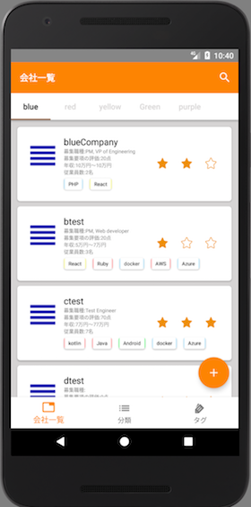
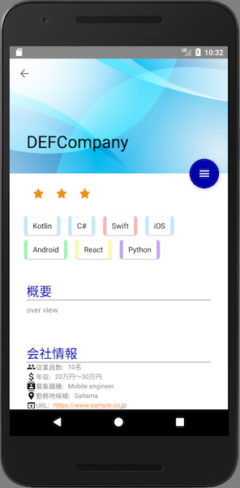

# コムリス
空いた時間でチマチマ作った会社情報を保持するAndroidアプリケーションです。  
会社情報は自分で手動登録する必要がありますが、私のリポジトリにある  
`comlis-web-scraping`と`comlis-data-store`  
を導入することでリモートからデータを取得することも可能です。  
ただしスクレイピング部分は自分でプログラミングする必要があります。  

This application contains deliverables distributed under the Apache License 2.0  
[Apache License Version 2.0](http://www.apache.org/licenses/LICENSE-2.0)

# 開発環境
  - Android Studio3.0.1
  - gradle 2.2.3

# 使い方
主要な画面の簡単な説明と使い方を示します。  
会社情報登録画面やタグ付与画面、ダイアログ等もありますが、詳細な説明は不要と思いますので省略します。
（説明が必要な画面だったらUIを見直す。）

# 会社一覧画面
登録した会社情報を分類ごとに一覧表示する画面です。  
アプリ起動時に表示される画面で、戻るボタンでの末端画面でもあります。  
新規登録した会社情報はリストの先頭に追加されます。タブの並び順は、分類画面のアイテム順になります。  
各会社情報に表示するタグは、先頭から最大5つとなります。  

## 各操作
1. 登録  
会社一覧画面の右下にある丸い＋のボタンをタップすると、登録画面を表示します。必要な情報を入力して登録ボタンをタップしてください。全ての項目は後から変更することも可能です。
2. 編集  
会社情報詳細画面にて編集できます。そちらを参照ください。
3. 削除  
会社情報詳細画面にて削除できます。そちらを参照ください。
4. 検索  
画面上段のメニューにある虫眼鏡アイコンをタップすると検索画面を表示します。詳細は検索画面を参照ください。
5. リモート接続  
別途環境を作成することで、リモートから会社情報を取得することが可能です。詳細は「リモート接続」を参照ください。
6. 並び替え
各会社情報の左にある`≡`を押し続けた状態で上下に移動させてください。  
タブを跨いだ移動はできません。分類を変更する場合は会社情報詳細画面で行なってください。

## 画面イメージ
  

# 会社情報詳細画面
会社情報の編集や削除を行う画面です。  
会社一覧画面で任意の会社情報をタップするとこの画面に遷移します。  

## 各操作
1. 編集  
右にある`≡`をタップするとメニューが表示されます。その中の鉛筆アイコンをタップしてください。  
すると各項目の右に鉛筆アイコンが表示されますので、編集したい項目の鉛筆アイコンをタップし、編集画面で任意に編集してください。
2. タグの付与
右にある`≡`をタップするとメニューが表示されます。その中のタグアイコンをタップしてください。
タグ付与画面が表示されますので、好きなタグを選択し、右下の丸いチェックアイコンをタップして決定してください。
3. 削除
右にある`≡`をタップするとメニューが表示されます。その中のゴミ箱アイコンをタップしてください。
アプリでも警告表示されますが、一度削除してしまった会社情報は復元できません。十分注意して削除してください。

## 画面イメージ
  

# 検索画面
登録した会社情報を文字列検索する画面です。  
検索は文字を入力したタイミングでリアルタイムに行われます。  
検索対象となる項目は以下の通りです。  
  - 会社名
  - 会社の概要
  - 会社の詳細

# 分類画面
分類情報を登録または編集する画面です。  
ここで登録した分類は、会社一覧画面のタブになります。  
識別しやすいよう、分類にはテーマカラーを指定できます。  
テーマカラーは会社一覧画面や会社詳細画面に反映されます。

## 各操作
1. 登録  
右下の丸い+ボタンをタップし、分類登録ダイアログから登録します。
2. 編集  
分類一覧から、名前またはカラーを変更したい分類をタップし、ダイアログから編集します。
3. 削除
分類一覧から、削除したい分類をタップし、ダイアログから削除します。  
誤操作を防ぐため分類に1つ以上会社情報が登録されている場合は削除できません。
4. 並び替え
各分類の左にある`≡`を押し続けた状態で上下に移動させてください。  

## 画面イメージ

# タグ画面
会社情報のタグを表示する画面です。

## 各操作
1. 登録
右下の丸い+ボタンをタップし、タグ登録ダイアログから登録します。
2. 編集  
タグ一覧から、名前またはカラーを変更したいタグをタップし、ダイアログから編集します。
3. 削除  
タグ一覧から、削除したいタグをタップし、ダイアログから削除します。  
分類と異なり、1つ以上の会社情報に付与されていても削除することができます。削除の際はご注意ください。
4. 並び替え
タグ画面は`Flexbox-layout`を使用しており、上下左右に並び変えることができます。  

## 画面イメージ

# リモート接続
別のリポジトリである`comlis-web-scraping`と`comlis-data-store`を組み合わせることでリモートから会社情報を取得することが可能です。
`comlis-web-scraping`はどこかのサイトから会社情報をスクレイピングするための枠組みを提供します。  
`node.js`で作成しており、docker上で動作するように作っています。  
スクレイピング部分は色々あるので各自で作成してもらう方針としました。  
`comlis-data-store`はスクレイピングした会社情報を保持するアプリケーションで、情報の保存や取得APIを提供します。  
`kotlin`と`Spring-boot`、`Redis`で作成しており、docker上で動作するように作っています。  
こちらはdockerが動く環境であれば環境変数の設定のみで動作します。  
