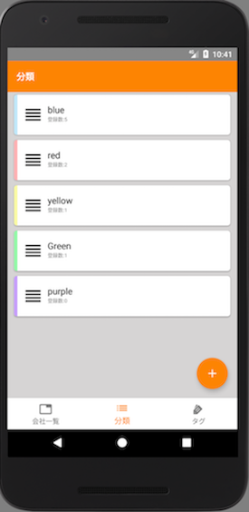
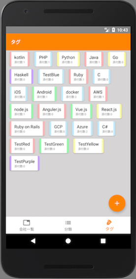

# コムリス
空いた時間でチマチマ作った転職用会社情報保持アプリです。

This application contains deliverables distributed under the Apache License 2.0  
[Apache License Version 2.0](http://www.apache.org/licenses/LICENSE-2.0)

# SDK version
* min_sdk_version: 23
* target_sdk_version: 26

# Environment
* Kotlin 1.1.50
* gradle 2.2.3

# Library
* RxKotlin 2.1.0
* RxAndroid 2.0.1
* RxJava 2.1.3
* RxBinding-kotlin 2.0.0
* Flexbox-layout 0.3.0-alpha4(RecyclerView対応版)
* databinding
* Dagger 2.11
* Lottie 1.5.3
* Android-Orma 4.2.5
* deployGate
* Retrofit 2.3.0
* OkHttp 3.8.1

# Features
This app can register company information, attach tag, category classification, search, etc.
Company information needs to be registered manually.

# Screenshot
  
